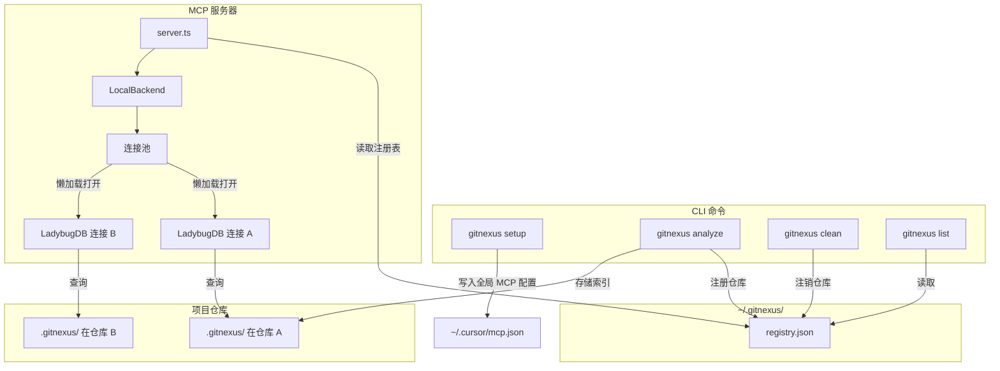
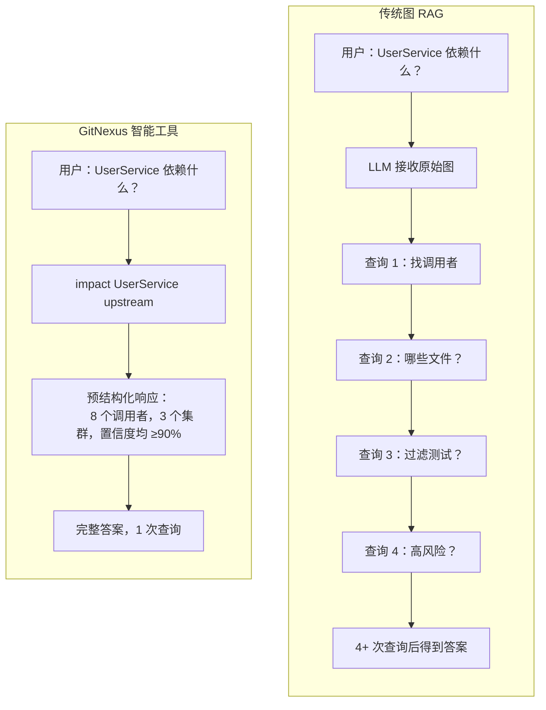

# GitNexus
**⚠️ 重要声明：** GitNexus **没有**任何官方加密货币、代币或硬币。任何在 Pump.fun 或其他平台上以 GitNexus 名义发行的代币/硬币均与本项目及其维护者**无关联、未经授权、也非本项目创建**。请勿购买任何声称与 GitNexus 相关联的加密货币。

> 🌐 语言 / Language: **中文** | [English](README.md)

<div align="center">

  <a href="https://trendshift.io/repositories/19809" target="_blank">
    
  </a>

  <h2>加入官方 Discord 讨论想法、问题等！</h2>

  <a href="https://discord.gg/MgJrmsqr62">
    
  </a>
  <a href="https://www.npmjs.com/package/gitnexus">
    
  </a>
  <a href="https://polyformproject.org/licenses/noncommercial/1.0.0/">
    
  </a>

  <p><strong>企业版（SaaS & 自托管）</strong> - <a href="https://akonlabs.com">akonlabs.com</a></p>

</div>

**为 AI 代理构建上下文神经系统。**

将任意代码库索引为知识图谱——涵盖所有依赖关系、调用链、功能群集和执行流程——并通过智能工具暴露出来，让 AI 代理不再遗漏任何代码。


https://github.com/user-attachments/assets/172685ba-8e54-4ea7-9ad1-e31a3398da72


> *类似 DeepWiki，但更深入。* DeepWiki 帮你**理解**代码，GitNexus 让你**分析**代码——因为知识图谱追踪每一段关系，而不仅仅是描述。

**一言以蔽之：** **Web UI** 是快速与任意代码库对话的方式；**CLI + MCP** 则让你的 AI 代理真正可靠——它为 Cursor、Claude Code、Codex 等工具提供深度架构视图，使其不再遗漏依赖、破坏调用链或盲目提交修改。即使是较小的模型也能获得完整的架构清晰度，从而与顶级大模型竞争。

---

## Star 历史

[](https://www.star-history.com/#abhigyanpatwari/GitNexus&type=date&legend=top-left)


## 两种使用方式

|                   | **CLI + MCP**                                            | **Web UI**                                             |
| ----------------- | -------------------------------------------------------- | ------------------------------------------------------ |
| **是什么**  | 本地索引代码库，通过 MCP 连接 AI 代理                    | 可视化图形浏览器 + 浏览器内 AI 对话                   |
| **适合**    | 日常开发（Cursor、Claude Code、Codex、Windsurf、OpenCode） | 快速探索、演示、一次性分析                             |
| **规模**    | 完整代码库，任意大小                                     | 受浏览器内存限制（约 5k 文件），或通过后端模式无限制   |
| **安装**    | `npm install -g gitnexus`                              | 无需安装 — [gitnexus.vercel.app](https://gitnexus.vercel.app) |
| **存储**    | LadybugDB 原生（快速、持久化）                            | LadybugDB WASM（内存中，按会话）                       |
| **解析**    | Tree-sitter 原生绑定                                     | Tree-sitter WASM                                       |
| **隐私**    | 完全本地，无网络请求                                     | 完全在浏览器中，无服务器                               |

> **桥接模式：** `gitnexus serve` 将两者连接——Web UI 自动检测本地服务器，可浏览所有 CLI 索引的代码库，无需重新上传或重新索引。

---

## 企业版

GitNexus 提供**企业级产品**——可选全托管 **SaaS** 或**自托管**部署，同时支持对 OSS 版本进行合规**商业授权**。

企业版包含：
- **PR 审查** - 自动对拉取请求进行影响范围分析
- **自动更新代码 Wiki** - 始终保持最新的文档（代码 Wiki 也在 OSS 中提供）
- **自动重新索引** - 知识图谱自动保持新鲜
- **多仓库支持** - 跨仓库统一图谱
- **OCaml 支持** - 扩展语言覆盖
- **优先功能/语言支持** - 申请新语言或功能

**即将推出：**
- 自动回归取证
- 端到端测试生成

👉 了解更多，请访问 [akonlabs.com](https://akonlabs.com)

💬 商业授权或企业咨询，请在 [Discord](https://discord.gg/AAsRVT6fGb) 联系我们，或发送邮件至 founders@akonlabs.com

---

## 开发文档

- [ARCHITECTURE.md](ARCHITECTURE.md) — 包结构、索引→图谱→MCP 流程、修改指南
- [RUNBOOK.md](RUNBOOK.md) — 分析、嵌入、过期索引、MCP 恢复、CI 片段
- [GUARDRAILS.md](GUARDRAILS.md) — 贡献者和代理的安全规则及操作"信号"
- [CONTRIBUTING.md](CONTRIBUTING.md) — 许可证、环境搭建、提交规范和拉取请求
- [TESTING.md](TESTING.md) — `gitnexus` 和 `gitnexus-web` 的测试命令

## CLI + MCP（推荐）

CLI 为你的仓库建立索引，并运行 MCP 服务器，使 AI 代理获得深度代码感知能力。

### 快速开始

```bash
# 在仓库根目录运行，对代码库建立索引
npx gitnexus analyze
```

就这么简单。该命令会索引代码库、安装代理技能、注册 Claude Code 钩子，并创建 `AGENTS.md` / `CLAUDE.md` 上下文文件——一条命令全部完成。

要为编辑器配置 MCP，运行一次 `npx gitnexus setup`，或按下文手动配置。

### MCP 配置

`gitnexus setup` 自动检测你的编辑器并写入正确的全局 MCP 配置，只需运行一次。

### 编辑器支持

| 编辑器                | MCP | 技能 | 钩子（自动增强）                | 支持级别        |
| --------------------- | --- | ---- | -------------------------------- | --------------- |
| **Claude Code** | 是  | 是   | 是（PreToolUse + PostToolUse）   | **完整**        |
| **Cursor**      | 是  | 是   | —                               | MCP + 技能      |
| **Codex**       | 是  | 是   | —                               | MCP + 技能      |
| **Windsurf**    | 是  | —   | —                               | MCP             |
| **OpenCode**    | 是  | 是   | —                               | MCP + 技能      |

> **Claude Code** 获得最深度的集成：MCP 工具 + 代理技能 + PreToolUse 钩子（用图谱上下文丰富搜索）+ PostToolUse 钩子（提交后检测过期索引并提示代理重新索引）。

## 社区集成

由社区构建——非官方维护，但值得关注。

| 项目 | 作者 | 描述 |
|------|------|------|
| [pi-gitnexus](https://github.com/tintinweb/pi-gitnexus) | [@tintinweb](https://github.com/tintinweb) | GitNexus 的 [pi](https://pi.dev) 插件 — `pi install npm:pi-gitnexus` |
| [gitnexus-stable-ops](https://github.com/ShunsukeHayashi/gitnexus-stable-ops) | [@ShunsukeHayashi](https://github.com/ShunsukeHayashi) | 稳定运维和部署工作流（Miyabi 生态） |

> 有基于 GitNexus 构建的项目？开一个 PR 添加到这里！

如果你更喜欢手动配置：

**Claude Code**（完整支持——MCP + 技能 + 钩子）：

```bash
# macOS / Linux
claude mcp add gitnexus -- npx -y gitnexus@latest mcp

# Windows
claude mcp add gitnexus -- cmd /c npx -y gitnexus@latest mcp
```

**Codex**（完整支持——MCP + 技能）：

```bash
codex mcp add gitnexus -- npx -y gitnexus@latest mcp
```

**Cursor**（`~/.cursor/mcp.json` — 全局，适用于所有项目）：

```json
{
  "mcpServers": {
    "gitnexus": {
      "command": "npx",
      "args": ["-y", "gitnexus@latest", "mcp"]
    }
  }
}
```

**OpenCode**（`~/.config/opencode/config.json`）：

```json
{
  "mcp": {
    "gitnexus": {
      "type": "local",
      "command": ["gitnexus", "mcp"]
    }
  }
}
```

**Codex**（`~/.codex/config.toml` 系统范围，或 `.codex/config.toml` 项目范围）：

```toml
[mcp_servers.gitnexus]
command = "npx"
args = ["-y", "gitnexus@latest", "mcp"]
```

### CLI 命令

```bash
gitnexus setup                   # 为编辑器配置 MCP（一次性）
gitnexus analyze [path]          # 索引仓库（或更新过期索引）
gitnexus analyze --force         # 强制完整重新索引
gitnexus analyze --skills        # 从检测到的社区生成仓库专属技能文件
gitnexus analyze --skip-embeddings  # 跳过嵌入生成（更快）
gitnexus analyze --skip-agents-md  # 保留自定义 AGENTS.md/CLAUDE.md gitnexus 段落
gitnexus analyze --skip-git        # 索引非 Git 仓库的文件夹
gitnexus analyze --embeddings    # 启用嵌入生成（更慢，搜索更好）
gitnexus analyze --verbose       # 当解析器不可用时记录跳过的文件
gitnexus analyze --worker-timeout 60  # 增加慢解析的 worker 超时时间
gitnexus mcp                     # 启动 MCP 服务器（stdio）——服务所有已索引仓库
gitnexus serve                   # 启动本地 HTTP 服务器（多仓库）供 Web UI 连接
gitnexus list                    # 列出所有已索引仓库
gitnexus status                  # 显示当前仓库的索引状态
gitnexus clean                   # 删除当前仓库的索引
gitnexus clean --all --force     # 删除所有索引
gitnexus wiki [path]             # 从知识图谱生成仓库 Wiki
gitnexus wiki --model <model>    # 使用自定义 LLM 模型生成 Wiki（默认：gpt-4o-mini）
gitnexus wiki --base-url <url>   # 使用自定义 LLM API base URL 生成 Wiki

# 仓库组（多仓库 / monorepo 服务追踪）
gitnexus group create <name>                                   # 创建仓库组
gitnexus group add <group> <groupPath> <registryName>          # 向组中添加仓库
gitnexus group remove <group> <groupPath>                      # 按层级路径从组中移除仓库
gitnexus group list [name]                                     # 列出组，或显示单个组的配置
gitnexus group sync <name>                                     # 提取合约并在仓库/服务间匹配
gitnexus group contracts <name>  # 检查提取的合约和交叉链接
gitnexus group query <name> <q>  # 在组内所有仓库中搜索执行流程
gitnexus group status <name>     # 检查组内仓库的过期状态
```

如果 `analyze` 报告 worker 解析超时，它会继续运行并安全降级。要给慢速 worker 更多时间，使用 `gitnexus analyze --worker-timeout 60` 或设置 `GITNEXUS_WORKER_SUB_BATCH_TIMEOUT_MS=60000`。对于超大文件，`GITNEXUS_WORKER_SUB_BATCH_MAX_BYTES` 控制 worker 任务的字节预算。

### AI 代理获得的能力

通过 MCP 暴露 **16 个工具**（11 个仓库级 + 5 个组级）：

| 工具               | 功能                                                      | `repo` 参数 |
| ------------------ | --------------------------------------------------------- | ----------- |
| `list_repos`     | 发现所有已索引仓库                                        | —          |
| `query`          | 流程分组混合搜索（BM25 + 语义 + RRF）                     | 可选        |
| `context`        | 360 度符号视图——分类引用、流程参与情况                   | 可选        |
| `impact`         | 影响范围分析，带深度分组和置信度                          | 可选        |
| `detect_changes` | Git 差异影响——将变更行映射到受影响的流程                  | 可选        |
| `rename`         | 多文件协调重命名，结合图谱和文本搜索                      | 可选        |
| `cypher`         | 原始 Cypher 图查询                                        | 可选        |
| `group_list`     | 列出已配置的仓库组                                        | —          |
| `group_sync`     | 提取合约并在仓库/服务间匹配                               | —          |
| `group_contracts`| 检查提取的合约和交叉链接                                  | —          |
| `group_query`    | 在组内所有仓库中搜索执行流程                              | —          |
| `group_status`   | 检查组内仓库的过期状态                                    | —          |

> 当只有一个仓库被索引时，所有工具的 `repo` 参数可省略。有多个仓库时，请指定目标仓库：`query({query: "auth", repo: "my-app"})`。

**即时上下文资源：**

| 资源                                      | 用途                                               |
| ----------------------------------------- | -------------------------------------------------- |
| `gitnexus://repos`                      | 列出所有已索引仓库（先读取此项）                   |
| `gitnexus://repo/{name}/context`        | 代码库统计、过期检查、可用工具                     |
| `gitnexus://repo/{name}/clusters`       | 所有功能集群及内聚分数                             |
| `gitnexus://repo/{name}/cluster/{name}` | 集群成员和详情                                     |
| `gitnexus://repo/{name}/processes`      | 所有执行流程                                       |
| `gitnexus://repo/{name}/process/{name}` | 完整流程跟踪及步骤                                 |
| `gitnexus://repo/{name}/schema`         | 用于 Cypher 查询的图谱 Schema                      |

**2 个 MCP 提示词**，用于引导工作流：

| 提示词            | 功能                                                              |
| ----------------- | ----------------------------------------------------------------- |
| `detect_impact` | 提交前变更分析——范围、受影响的流程、风险等级                    |
| `generate_map`  | 从知识图谱生成架构文档，含 Mermaid 图                            |

**4 个代理技能**自动安装到 `.claude/skills/`：

- **探索** — 使用知识图谱导航不熟悉的代码
- **调试** — 通过调用链追踪 Bug
- **影响分析** — 在修改前分析影响范围
- **重构** — 利用依赖映射规划安全重构

**通过 `--skills` 生成仓库专属技能：**

运行 `gitnexus analyze --skills` 时，GitNexus 会检测代码库的功能区域（通过 Leiden 社区检测），并在 `.claude/skills/generated/` 下为每个功能区域生成 `SKILL.md` 文件。每个技能文件描述模块的关键文件、入口点、执行流程和跨区域连接——使你的 AI 代理能够获取当前工作区域的精准上下文。每次运行 `--skills` 时技能文件会重新生成以保持最新。

---

## 多仓库 MCP 架构

GitNexus 使用**全局注册表**，使一个 MCP 服务器可以服务多个已索引仓库。无需为每个项目单独配置 MCP——只需配置一次，处处可用。



**工作原理：** 每次 `gitnexus analyze` 将索引存储在仓库内的 `.gitnexus/`（可携带、已被 gitignore），并在 `~/.gitnexus/registry.json` 中注册一个指针。AI 代理启动时，MCP 服务器读取注册表并可服务任意已索引仓库。LadybugDB 连接在首次查询时懒加载打开，5 分钟不活动后被逐出（最多 5 个并发）。如果只有一个仓库被索引，所有工具的 `repo` 参数均可省略——代理无需做任何更改。

---

## Web UI（基于浏览器）

一个客户端图形浏览器和 AI 对话——你的代码永远不会离开你的机器。

**立即体验：** [gitnexus.vercel.app](https://gitnexus.vercel.app) — 在本地运行 `npx gitnexus@latest serve`，页面会自动连接到你的本地后端。


或者在本地运行前端：

```bash
git clone https://github.com/abhigyanpatwari/gitnexus.git
cd gitnexus/gitnexus-shared && npm install && npm run build
cd ../gitnexus-web && npm install
npm run dev
# 然后在另一个终端启动前端连接的后端：
npx gitnexus@latest serve
```

## Docker

官方 Docker 配置提供由 `docker-compose.yaml` 编排的**两个已签名镜像**。每个镜像同时发布到 **GitHub Container Registry**（GHCR）和 **Docker Hub**——相同构建、相同摘要、相同 Cosign 签名——选择你偏好的注册表即可：

| 用途                                                             | GHCR（`docker-compose.yaml` 中默认）          | Docker Hub 镜像                             |
| ---------------------------------------------------------------- | --------------------------------------------- | ------------------------------------------- |
| CLI / `gitnexus serve` 后端（HTTP API 端口 `4747`、MCP、索引器） | `ghcr.io/abhigyanpatwari/gitnexus:latest`     | `akonlabs/gitnexus:latest`                  |
| 静态 Web UI（端口 `4173`）                                       | `ghcr.io/abhigyanpatwari/gitnexus-web:latest` | `akonlabs/gitnexus-web:latest`              |

> **注意——镜像重命名。** 早期版本在 `ghcr.io/abhigyanpatwari/gitnexus` 下发布 Web UI。引入捆绑后端后，该镜像名称现在托管 CLI/服务器镜像，UI 移至 `ghcr.io/abhigyanpatwari/gitnexus-web`。旧标签仍可拉取，但新版本仅在新名称下发布。请相应更新你的 `docker run` / compose 文件（或直接采用捆绑的 compose）。

### 一键启动

```bash
docker compose up -d
```

这会在 `http://localhost:4747` 启动服务器，在 `http://localhost:4173` 启动 Web UI。UI 会自动检测服务器，因为浏览器在宿主机上运行，通过映射端口访问容器。

命名卷（`gitnexus-data`）将全局注册表、索引和克隆的仓库持久化存储在服务器容器内的 `/data/gitnexus`。要使宿主机上的仓库可被索引，在启动前设置 `WORKSPACE_DIR`：

```bash
WORKSPACE_DIR=$HOME/code docker compose up -d
# 在服务器容器内，该目录以只读方式挂载在 /workspace
docker compose exec gitnexus-server gitnexus index /workspace/my-repo
```

### 直接使用 `docker run`

```bash
# 服务器
docker run --rm -d \
  --name gitnexus-server \
  -p 4747:4747 \
  -v gitnexus-data:/data/gitnexus \
  ghcr.io/abhigyanpatwari/gitnexus:latest

# Web UI
docker run --rm -d \
  --name gitnexus-web \
  -p 4173:4173 \
  ghcr.io/abhigyanpatwari/gitnexus-web:latest
```

可选环境文件（覆盖镜像标签、容器名称、端口、工作区目录）：

```bash
cp .env.example .env
docker compose --env-file .env up -d
```

### 版本管理与供应链保护

Docker 镜像与 npm 包版本锁定：

- 稳定版镜像**仅从 `vX.Y.Z` git 标签发布**（通过由标签推送直接触发的 `docker.yml`），且工作流会拒绝构建，除非标签与 `gitnexus/package.json` 的版本完全匹配。因此 `ghcr.io/abhigyanpatwari/gitnexus:1.6.2`（及其 Docker Hub 镜像 `akonlabs/gitnexus:1.6.2`）与 `npm install gitnexus@1.6.2` 字节级别完全一致——无偏差，无来自 `main` 的浮动构建。两个注册表在单次构建步骤中接收相同摘要，因此可从任一拉取，签名验证结果一致。
- 候选版本镜像（如 `:1.7.0-rc.1`）随每个 RC npm 发布一起发布。它们由 `release-candidate.yml` 在 RC 标签创建并推送后将 `docker.yml` 作为可复用工作流调用来构建。
- `:latest` 仅从非预发布标签自动提升（由 Docker 元数据 action 处理），因此始终指向真实的、已在 npm 发布的版本。

两个镜像均使用工作流的 GitHub OIDC 身份通过 [Cosign 无密钥签名][cosign-keyless] 签名，并附带构建来源和 SBOM 证明。**这是你对供应链攻击的保护**：即使攻击者在其他地方重新发布同名镜像（或以某种方式推送到仿冒注册表），他们也无法伪造绑定到 `abhigyanpatwari/GitNexus` 的 `docker.yml` 的 Cosign 签名。在敏感环境中拉取前请始终验证：

**稳定版本** — 从 `v*` 标签引用签名：

```bash
cosign verify ghcr.io/abhigyanpatwari/gitnexus:1.6.2 \
  --certificate-identity-regexp '^https://github\.com/abhigyanpatwari/GitNexus/\.github/workflows/docker\.yml@refs/tags/v[0-9]+\.[0-9]+\.[0-9]+(-[a-zA-Z0-9.]+)?$' \
  --certificate-oidc-issuer https://token.actions.githubusercontent.com

# 相同签名验证 Docker Hub 镜像（相同摘要）：
cosign verify docker.io/akonlabs/gitnexus:1.6.2 \
  --certificate-identity-regexp '^https://github\.com/abhigyanpatwari/GitNexus/\.github/workflows/docker\.yml@refs/tags/v[0-9]+\.[0-9]+\.[0-9]+(-[a-zA-Z0-9.]+)?$' \
  --certificate-oidc-issuer https://token.actions.githubusercontent.com
```

正则表达式将证书身份固定到此仓库的 `docker.yml` 工作流**从 `v*` 标签运行**——拒绝未签名镜像、其他工作流签名的镜像，以及从未受保护引用签名的镜像。两个注册表的签名完全相同，因为两组标签都在单次工作流运行中以同一摘要签名。

**候选版本** — 从 `refs/heads/main` 签名（`release-candidate.yml` 将 `docker.yml` 作为可复用工作流调用时的调用方引用）：

```bash
cosign verify ghcr.io/abhigyanpatwari/gitnexus:1.7.0-rc.1 \
  --certificate-identity 'https://github.com/abhigyanpatwari/GitNexus/.github/workflows/docker.yml@refs/heads/main' \
  --certificate-oidc-issuer https://token.actions.githubusercontent.com
```

你也可以检查构建来源和 SBOM：

```bash
cosign download attestation ghcr.io/abhigyanpatwari/gitnexus:1.6.2 \
  --predicate-type https://slsa.dev/provenance/v1
```

#### Kubernetes：在准入时强制签名验证

对于 Kubernetes 部署，部署捆绑的 [`ClusterImagePolicy`](deploy/kubernetes/cluster-image-policy.yaml)，使 [Sigstore policy-controller][policy-controller] 拒绝任何镜像未由此仓库 `docker.yml` 从 `vX.Y.Z` 标签签名的 GitNexus Pod——与上述 `cosign verify` 片段固定的身份相同。

```bash
# 1. 安装控制器（一次性，集群范围）
helm repo add sigstore https://sigstore.github.io/helm-charts && helm repo update
helm install policy-controller -n cosign-system --create-namespace \
  sigstore/policy-controller

# 2. 为你的命名空间启用
kubectl label namespace <your-ns> policy.sigstore.dev/include=true

# 3. 应用策略
kubectl apply -f deploy/kubernetes/cluster-image-policy.yaml
```

之后，尝试部署未签名镜像——或非由 `abhigyanpatwari/GitNexus` 的 `docker.yml` 在 `v*` 标签签名的任何镜像——将在 Pod 创建前被准入 Webhook 拒绝。这将可验证的签名转变为强制策略，这正是大多数集群实际需要的供应链控制。

[cosign-keyless]: https://docs.sigstore.dev/cosign/signing/overview/
[policy-controller]: https://docs.sigstore.dev/policy-controller/overview/

### 文件

- [Dockerfile.web](Dockerfile.web) — 构建 `gitnexus-shared` 和 `gitnexus-web`，然后提供生产前端。
- [Dockerfile.cli](Dockerfile.cli) — 构建 CLI/服务器（含原生依赖）并运行 `gitnexus serve --host 0.0.0.0`。
- [docker-compose.yaml](docker-compose.yaml) — 并排启动两个已签名镜像。
- [.env.example](.env.example) — 镜像名称、容器名称、端口和工作区挂载的覆盖配置。

Web UI 使用与 CLI 相同的索引管道，但完全在 WebAssembly 中运行（Tree-sitter WASM、LadybugDB WASM、浏览器内嵌入）。非常适合快速探索，但对较大仓库受浏览器内存限制。

**本地后端模式：** 运行 `gitnexus serve` 并在本地打开 Web UI——它会自动检测服务器并显示所有已索引仓库，支持完整 AI 对话。无需重新上传或重新索引。代理工具（Cypher 查询、搜索、代码导航）自动通过后端 HTTP API 路由。

---

## GitNexus 解决的问题

**Cursor**、**Claude Code**、**Codex**、**Cline**、**Roo Code** 和 **Windsurf** 等工具很强大——但它们并不真正了解你的代码库结构。

**会发生什么：**

1. AI 编辑了 `UserService.validate()`
2. 不知道有 47 个函数依赖它的返回类型
3. **破坏性修改就这样发布了**

### 传统图 RAG 与 GitNexus 的对比

传统方式将原始图边传给 LLM，希望它自己探索足够多。GitNexus **在索引时预先计算结构**——聚类、追踪、评分——使工具在一次调用中返回完整上下文：



**核心创新：预计算关系智能**

- **可靠性** — LLM 无法遗漏上下文，它已包含在工具响应中
- **Token 效率** — 无需 10 次查询链来理解一个函数
- **模型民主化** — 较小的 LLM 也能工作，因为工具承担了繁重工作

---

## 工作原理

GitNexus 通过多阶段索引管道构建代码库的完整知识图谱：

1. **结构** — 遍历文件树，映射文件夹/文件关系
2. **解析** — 使用 Tree-sitter AST 提取函数、类、方法和接口
3. **解析** — 使用语言感知逻辑跨文件解析导入、函数调用、继承、构造函数推断和 `self`/`this` 接收者类型
4. **聚类** — 将相关符号分组为功能社区
5. **流程** — 从入口点通过调用链追踪执行流程
6. **搜索** — 构建混合搜索索引以实现快速检索

### 支持的语言

| 语言 | 导入 | 命名绑定 | 导出 | 继承 | 类型注解 | 构造函数推断 | 配置 | 框架 | 入口点 |
|------|------|----------|------|------|----------|-------------|------|------|--------|
| TypeScript | ✓ | ✓ | ✓ | ✓ | ✓ | ✓ | ✓ | ✓ | ✓ |
| JavaScript | ✓ | ✓ | ✓ | ✓ | — | ✓ | ✓ | ✓ | ✓ |
| Python | ✓ | ✓ | ✓ | ✓ | ✓ | ✓ | ✓ | ✓ | ✓ |
| Java | ✓ | ✓ | ✓ | ✓ | ✓ | ✓ | — | ✓ | ✓ |
| Kotlin | ✓ | ✓ | ✓ | ✓ | ✓ | ✓ | — | ✓ | ✓ |
| C# | ✓ | ✓ | ✓ | ✓ | ✓ | ✓ | ✓ | ✓ | ✓ |
| Go | ✓ | — | ✓ | ✓ | ✓ | ✓ | ✓ | ✓ | ✓ |
| Rust | ✓ | ✓ | ✓ | ✓ | ✓ | ✓ | — | ✓ | ✓ |
| PHP | ✓ | ✓ | ✓ | — | ✓ | ✓ | ✓ | ✓ | ✓ |
| Ruby | ✓ | — | ✓ | ✓ | — | ✓ | — | ✓ | ✓ |
| Swift | — | — | ✓ | ✓ | ✓ | ✓ | ✓ | ✓ | ✓ |
| C | — | — | ✓ | — | ✓ | ✓ | — | ✓ | ✓ |
| C++ | — | — | ✓ | ✓ | ✓ | ✓ | — | ✓ | ✓ |
| Dart | ✓ | — | ✓ | ✓ | ✓ | ✓ | — | ✓ | ✓ |

**导入** — 跨文件导入解析 · **命名绑定** — `import { X as Y }` / 重导出追踪 · **导出** — 公开/导出符号检测 · **继承** — 类继承、接口、混入 · **类型注解** — 显式类型提取用于接收者解析 · **构造函数推断** — 从构造函数调用推断接收者类型（所有语言均包含 `self`/`this` 解析） · **配置** — 语言工具链配置解析（tsconfig、go.mod 等） · **框架** — 基于 AST 的框架模式检测 · **入口点** — 入口点评分启发式算法

---

## 工具示例

### 影响分析

```
impact({target: "UserService", direction: "upstream", minConfidence: 0.8})

目标：Class UserService (src/services/user.ts)

上游（依赖此符号的内容）：
  深度 1（将会破坏）：
    handleLogin [CALLS 90%] -> src/api/auth.ts:45
    handleRegister [CALLS 90%] -> src/api/auth.ts:78
    UserController [CALLS 85%] -> src/controllers/user.ts:12
  深度 2（可能受影响）：
    authRouter [IMPORTS] -> src/routes/auth.ts
```

选项：`maxDepth`、`minConfidence`、`relationTypes`（`CALLS`、`IMPORTS`、`EXTENDS`、`IMPLEMENTS`）、`includeTests`

### 流程分组搜索

```
query({query: "authentication middleware"})

processes:
  - summary: "LoginFlow"
    priority: 0.042
    symbol_count: 4
    process_type: cross_community
    step_count: 7

process_symbols:
  - name: validateUser
    type: Function
    filePath: src/auth/validate.ts
    process_id: proc_login
    step_index: 2

definitions:
  - name: AuthConfig
    type: Interface
    filePath: src/types/auth.ts
```

### 上下文（360 度符号视图）

```
context({name: "validateUser"})

symbol:
  uid: "Function:validateUser"
  kind: Function
  filePath: src/auth/validate.ts
  startLine: 15

incoming:
  calls: [handleLogin, handleRegister, UserController]
  imports: [authRouter]

outgoing:
  calls: [checkPassword, createSession]

processes:
  - name: LoginFlow (step 2/7)
  - name: RegistrationFlow (step 3/5)
```

### 检测变更（提交前）

```
detect_changes({scope: "all"})

summary:
  changed_count: 12
  affected_count: 3
  changed_files: 4
  risk_level: medium

changed_symbols: [validateUser, AuthService, ...]
affected_processes: [LoginFlow, RegistrationFlow, ...]
```

### 重命名（多文件）

```
rename({symbol_name: "validateUser", new_name: "verifyUser", dry_run: true})

status: success
files_affected: 5
total_edits: 8
graph_edits: 6     (高置信度)
text_search_edits: 2  (请仔细审查)
changes: [...]
```

### Cypher 查询

```cypher
-- 查找调用高置信度认证函数的内容
MATCH (c:Community {heuristicLabel: 'Authentication'})<-[:CodeRelation {type: 'MEMBER_OF'}]-(fn)
MATCH (caller)-[r:CodeRelation {type: 'CALLS'}]->(fn)
WHERE r.confidence > 0.8
RETURN caller.name, fn.name, r.confidence
ORDER BY r.confidence DESC
```

---

## Wiki 生成

从知识图谱生成 LLM 驱动的文档：

```bash
# 需要 LLM API 密钥（OPENAI_API_KEY 等）
gitnexus wiki

# 使用自定义模型或提供商
gitnexus wiki --model gpt-4o
gitnexus wiki --base-url https://api.anthropic.com/v1

# 强制完整重新生成
gitnexus wiki --force
```

Wiki 生成器读取已索引的图谱结构，通过 LLM 将文件分组为模块，生成每个模块的文档页面，并创建概述页面——所有内容均包含到知识图谱的交叉引用。

---

## 技术栈

| 层                        | CLI                                   | Web                                     |
| ------------------------- | ------------------------------------- | --------------------------------------- |
| **运行时**          | Node.js（原生）                       | 浏览器（WASM）                          |
| **解析**            | Tree-sitter 原生绑定                  | Tree-sitter WASM                        |
| **数据库**          | LadybugDB 原生                        | LadybugDB WASM                          |
| **嵌入**            | HuggingFace transformers.js（GPU/CPU）| transformers.js（WebGPU/WASM）          |
| **搜索**            | BM25 + 语义 + RRF                     | BM25 + 语义 + RRF                       |
| **代理接口**        | MCP（stdio）                          | LangChain ReAct 代理                    |
| **可视化**          | —                                    | Sigma.js + Graphology（WebGL）          |
| **前端**            | —                                    | React 18、TypeScript、Vite、Tailwind v4 |
| **聚类**            | Graphology                            | Graphology                              |
| **并发**            | Worker 线程 + async                   | Web Workers + Comlink                   |

---

## 路线图

### 积极构建中

- [ ] **LLM 集群丰富化** — 通过 LLM API 生成语义集群名称
- [ ] **AST 装饰器检测** — 解析 @Controller、@Get 等
- [ ] **增量索引** — 仅重新索引已更改的文件

### 最近完成

- [X] 构造函数推断类型解析，`self`/`this` 接收者映射
- [X] Wiki 生成、多文件重命名、Git 差异影响分析
- [X] 流程分组搜索、360 度上下文、Claude Code 钩子
- [X] 多仓库 MCP、零配置设置、14 种语言支持
- [X] 社区检测、流程检测、置信度评分
- [X] 混合搜索、向量索引

---

## 安全与隐私

- **CLI**：一切在本地运行。无网络调用。索引存储在 `.gitnexus/`（已被 gitignore）。全局注册表 `~/.gitnexus/` 仅存储路径和元数据。
- **Web**：一切在浏览器中运行。无代码上传到任何服务器。API 密钥仅存储在 localStorage 中。
- 开源——自行审计代码。

---

## 致谢

- [Tree-sitter](https://tree-sitter.github.io/) — AST 解析
- [LadybugDB](https://ladybugdb.com/) — 支持向量的嵌入式图数据库（前身为 KuzuDB）
- [Sigma.js](https://www.sigmajs.org/) — WebGL 图渲染
- [transformers.js](https://huggingface.co/docs/transformers.js) — 浏览器 ML
- [Graphology](https://graphology.github.io/) — 图数据结构
- [MCP](https://modelcontextprotocol.io/) — 模型上下文协议
